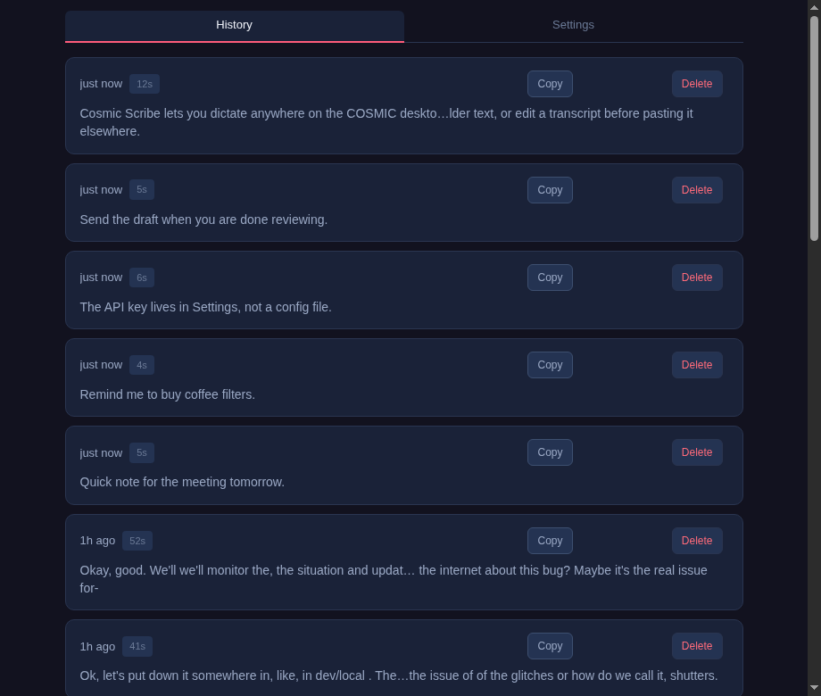
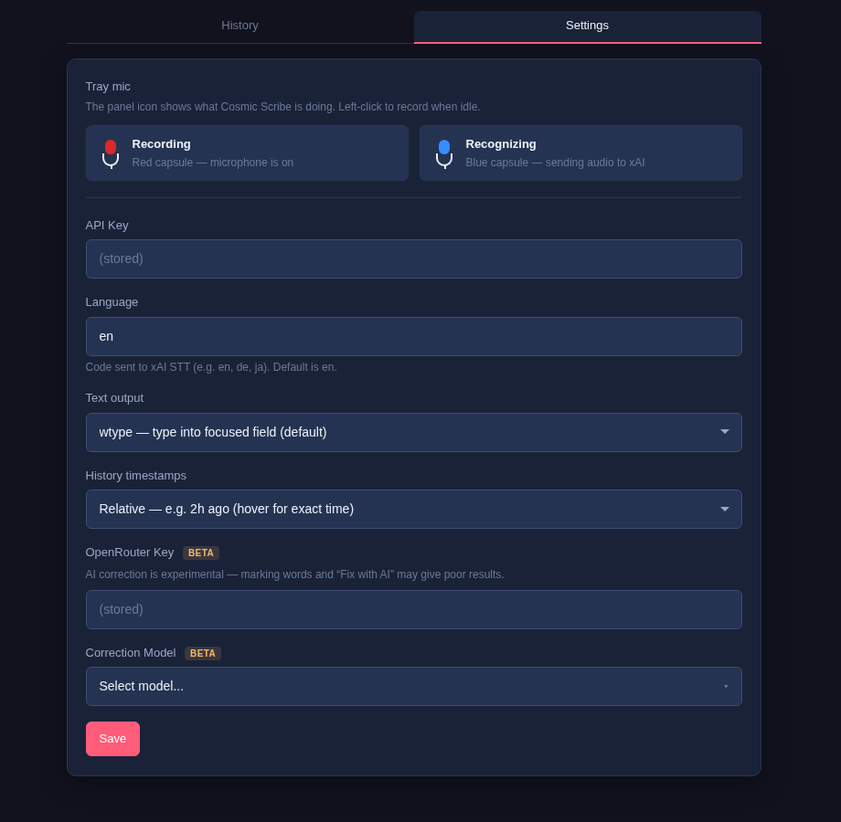
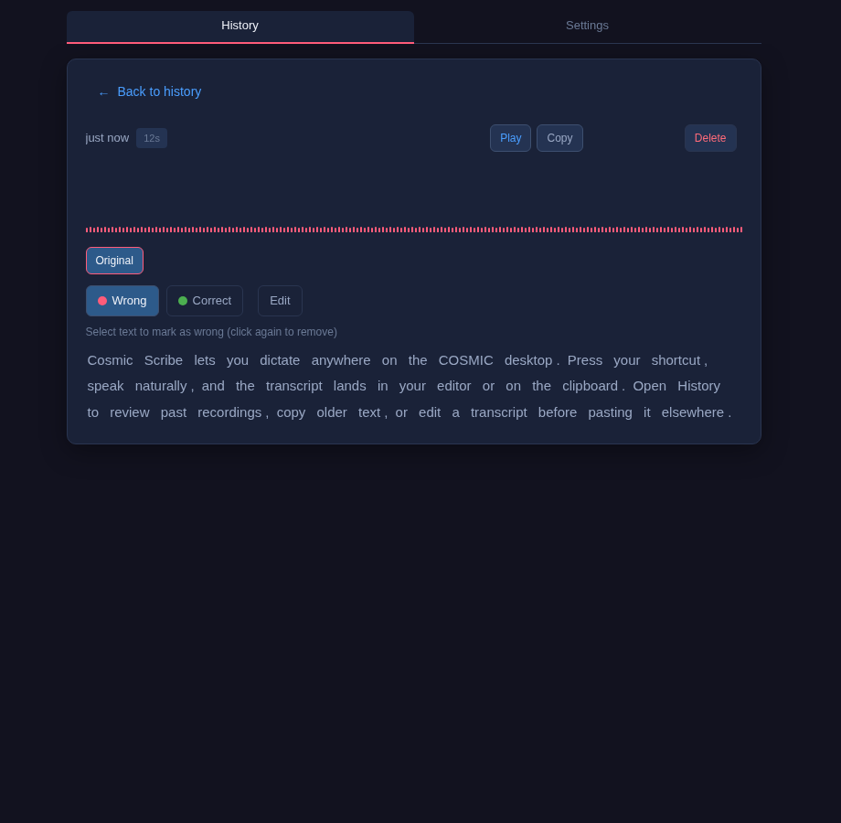

<p align="center">
  
</p>

# Cosmic Scribe

**Native voice dictation for the COSMIC desktop** — press a shortcut, speak, and text lands in your app. A tray mic shows what’s happening; **History** and **Settings** live in a focused app window. No clutter, no CLI for daily use.

Built for [COSMIC](https://github.com/pop-os/cosmic-epoch) on Pop!_OS and Fedora (Wayland). Transcription uses [xAI Grok speech-to-text](https://docs.x.ai/developers/models/speech-to-text) (paid API key) today; other providers are [planned](docs/BACKLOG.md).

> **Independent project** — not affiliated with System76, Pop!_OS, or the COSMIC desktop. See [docs/BRANDING.md](docs/BRANDING.md).

## Why Cosmic Scribe

| What you get | Why it matters |
|--------------|----------------|
| **Global shortcut** | One key combo — bind `cosmic-scribe --trigger` in **Settings → Keyboard** ([guide](docs/SHORTCUT.md)). Fastest way to dictate. |
| **Tray mic** | Always visible status — see [Tray states](#tray-mic-states) below. Left-click to record when idle. |
| **Native app** | **Cosmic Scribe** in the app menu — **History** and **Settings** tabs, same data as the daemon. |
| **Clipboard + typing** | Every transcript hits the clipboard; default mode also types into the focused field (`wtype`). |
| **History on disk** | Local recordings + transcripts. Copy an older take, edit text, listen back — or **Re-transcribe** if the network failed earlier. |
| **Minimal scope** | Dictation, tray, history, settings. No account system, no cloud sync, no feature bloat. |

## Tray mic states

The **capsule** (top of the mic) changes color; the stand stays in your theme colors.

| State | Capsule | What it means |
|-------|---------|---------------|
| Idle | White / dark (theme) | Ready — shortcut or tray click to record |
| **Recording** | **Red** | Microphone is on — speak now |
| **Recognizing** | **Blue** | Transcribing and pasting — until text is in your field (or clipboard) |

This legend is also in **Settings** inside the app.

| Idle | Recording | Recognizing |
|:---:|:---:|:---:|
|  |  |  |

## Screenshots

**App window** (demo data — `./scripts/capture-screenshots.sh`):

| History | Settings | Detail + waveform |
|:---:|:---:|:---:|
|  |  |  |

## Quick start

Full install guide (dependencies, Homebrew vs source, Tauri GUI): **[docs/INSTALL.md](docs/INSTALL.md)**

### 1. Dependencies

```bash
sudo dnf install alsa-utils wl-clipboard wtype libnotify
```

### 2. Install (daemon + app window)

**From git clone** (recommended):

```bash
git clone https://github.com/erik-balfe/cosmic-scribe.git
cd cosmic-scribe
./scripts/install-prod.sh
```

**Homebrew** installs the daemon only — then run `./scripts/install-gui-prod.sh` from a clone for the app menu entry. Details: [docs/INSTALL.md](docs/INSTALL.md).

You should see the **tray mic** and **Cosmic Scribe** in the app menu.

### 3. API key

Open **Cosmic Scribe → Settings**, paste your [xAI API key](https://console.x.ai/), Save. Recording is blocked until a key is stored.

### 4. Global shortcut (main workflow)

1. **Settings → Keyboard → Custom shortcuts** → Add.
2. **Name:** `Cosmic Scribe`
3. **Command:** full path to `cosmic-scribe --trigger` (e.g. `~/.local/bin/cosmic-scribe --trigger`).
4. Pick a combo (e.g. **Super+Shift+Space**).

Step-by-step: [docs/SHORTCUT.md](docs/SHORTCUT.md)

### 5. Dictate

1. Focus any text field.
2. Press your shortcut → tray capsule turns **red** → speak → shortcut again.
3. Capsule stays **blue** while recognizing and pasting, then idle when done (or clipboard only if you chose that in Settings).

### 6. When something goes wrong

- **Bad take while recording** — tray right-click → **Cancel recording**, or shortcut again.
- **Transcription stuck / network blip** — open **History**, select the entry, **Re-transcribe**. No re-recording needed.
- **Missed paste** — **History** → copy an older transcript.

## App window

| Tray menu | Opens |
|-----------|--------|
| **History** | Past recordings — list, playback, copy, edit, re-transcribe |
| **Settings** | API key, language, output mode, tray legend, optional AI correction |
| **Quit** | Stops the background daemon |

History files: `~/.local/share/cosmic-scribe/recordings/` (`.raw` audio, `.txt` transcript).

**Output modes** ([details](docs/OUTPUT.md)):

| Mode | Behavior |
|------|----------|
| **wtype** (default) | Clipboard + type into focused field |
| **clipboard** | Clipboard only — paste yourself (terminals) |

## Service commands (install / maintenance)

Not needed for daily use — `--install` enables `com.cosmic-scribe.service` (starts on login with the graphical session, same pattern as cosmic-paste):

| Command | Purpose |
|---------|---------|
| `cosmic-scribe --status` | Daemon running? paths? systemd unit? |
| `systemctl --user status com.cosmic-scribe.service` | Login autostart unit |
| `cosmic-scribe --stop` | Stop daemon |
| `cosmic-scribe --uninstall` | Remove install (keep data) |
| `cosmic-scribe --uninstall --purge` | Remove install + all local data |

## Uninstall

```bash
cosmic-scribe --uninstall
./scripts/uninstall-gui-prod.sh
cosmic-scribe --uninstall --purge   # optional: delete all data
brew uninstall cosmic-scribe        # if installed via Homebrew
```

Or `./scripts/uninstall.sh` — see [docs/INSTALL.md](docs/INSTALL.md).

## Requirements

| Item | Notes |
|------|--------|
| Desktop | COSMIC on Pop!_OS or Fedora, Wayland |
| API | [xAI API key](https://console.x.ai/) |
| Runtime tools | `arecord`, `wl-clipboard`, `wtype` (default mode), `libnotify` |
| Build (from source GUI) | Rust, Node, WebKitGTK — [docs/INSTALL.md](docs/INSTALL.md) |
| Binaries | `cosmic-scribe` (daemon); `cosmic-scribe-gui` (app window) |

## Privacy

Audio is sent to **xAI** for transcription. API keys and recording history stay **on your machine** (encrypted key storage). See [xAI terms](https://x.ai/).

## License

[MIT](LICENSE)

---

**Developers:** [CONTRIBUTING.md](CONTRIBUTING.md) · **Docs:** [docs/README.md](docs/README.md)